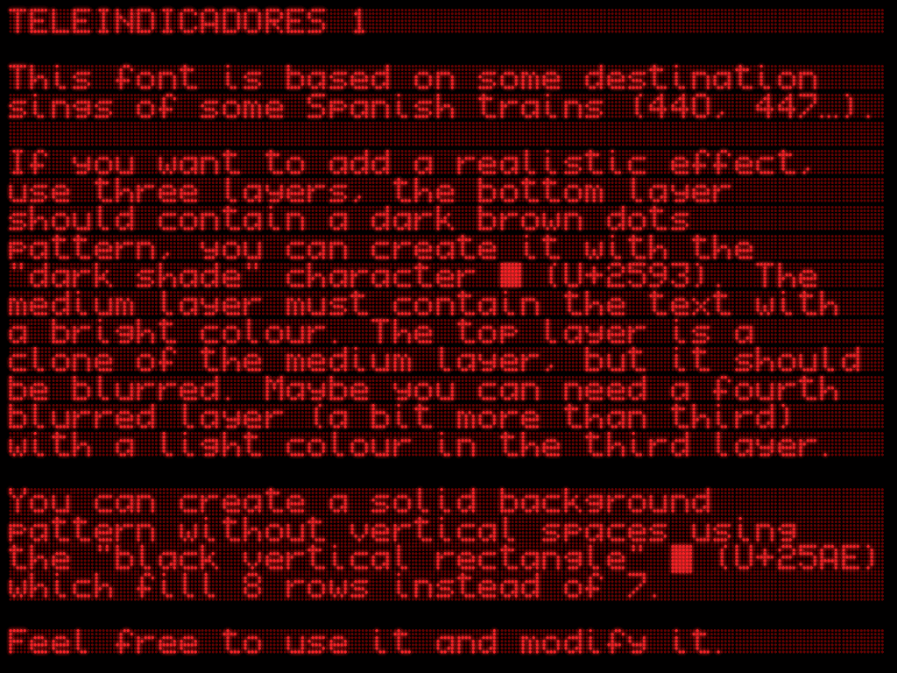
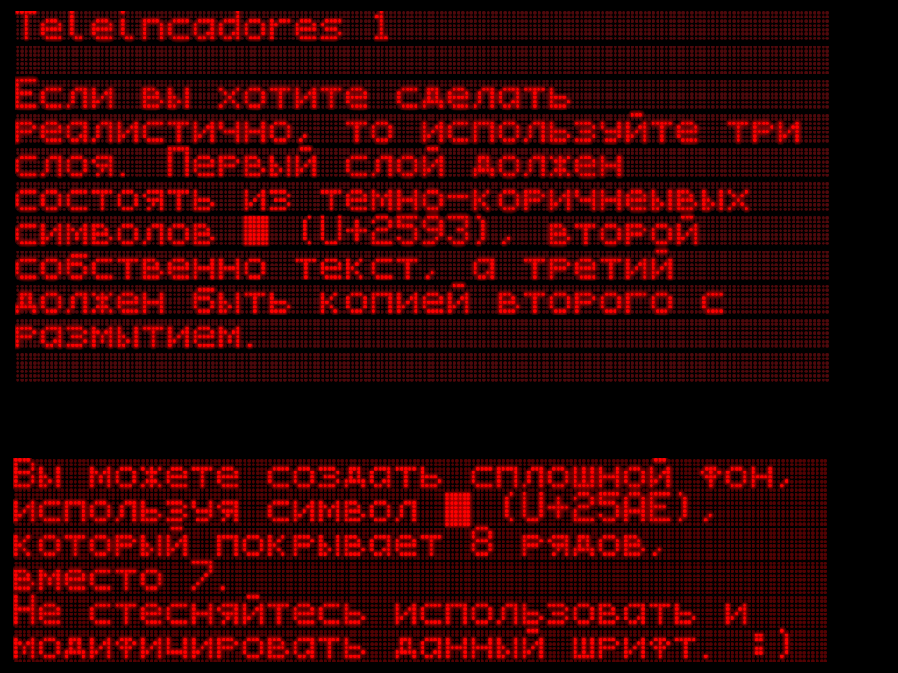

# Teleindicadores1
Font which based on some destination sings of some Spanish trains (440, 447…)  
5x7 dot matrix  
Included Latin, Greek and Cyrillic

## Credits
I am not the original creator of the font, simply corrected Cyrillic  
Original creator - 440EMU (how to contact him I do not know)  
Original work - https://fontlibrary.org/en/font/teleindicadores-1

## Usage

If you want to add a realistic effect, use three layers, the bottom layer should contain a dark brown dots pattern, you can create it with the "dark shade" character ▓ (U+2593). The medium layer must contain the text with a bright colour. The top layer is a clone of the medium layer, but it should be blurred. Maybe you can need a fourth blurred layer (a bit more than third) with a light colour in the third layer.

You can create a solid background pattern without vertical spaces using the "black vertical rectangle" ▮ (U+25AE)
which fill 8 rows instead of 7.

You can create the backgrounds copying these symbols/Вы можете создать фон используя эти символы:
▓
▮

The second symbol creates a background without spaces.
In some editors you could need to modify the linespacing.

To modify this font, you need download [FontForge](https://fontforge.github.io/en-US/), the powerful open source font editor.

## License
Like the original font, this one is in the public domain (Unlicense).
